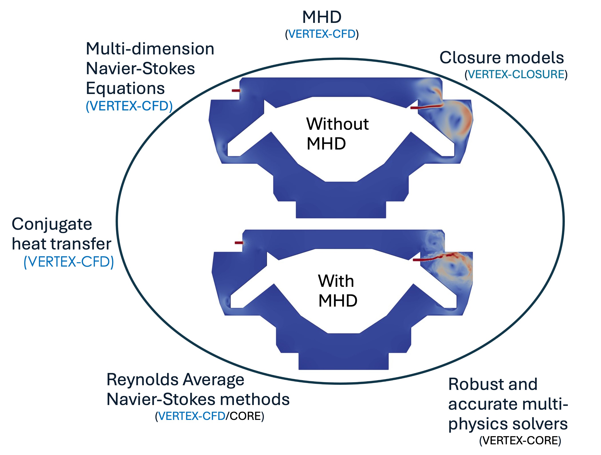

# Summary:

The demand for high-performance computational fluid dynamics and multiphysics software packages has grown in recent years as a response to effort in complex engineering and research applications. While the widespread deployment of high-performance computing (HPC) resources has enabled larger, more complex simulations to be conducted, few commercial or open-source software packages are available which scale performantly on CPU and GPU computing architectures, and represent the multitude of physical processes relevant to these applications. The VERTEX initiative is developed to address this technical gap, with a special emphasis on high-fidelity multiphysics modeling of coupled turbulent fluid flow, heat transfer, and magnetohydrodynamics for applications in fusion and fission energy, and other spaces. The VERTEX-CFD module was developed to solve the governing equations of these problems using a high-order continuous Galerkin finite element framework, and fully-implicit monolithic solvers. Special attention is being paid during the development process to verify and to validate the solver, and to ensure performance portability across both CPU and GPU computing platforms. A comprehensive verification and validation (V&V) suite and unit tests were designed to assess the accuracy and convergence behavior of the VERTEX-CFD module for problems taken from the published literature.

# Statement of need

Fusion energy development involves a wide range of disciplines to describe design and develop a functioning system. In fusion energy, a difficult engineering task is the fusion core component called a blanket. This component surrounds the burning plasma and must absorb nearly all the power from nuclear reactions; consequently, the blanket must breed fuel, provide nuclear shielding, provide a plasma--facing feature with high heat flux (i.e., source of power), and withstand several loading conditions ranging from normal to off-normal. This component involves multiple fluids (e.g., helium and liquid metal), is immersed in a strong magnetic field, operates at high temperatures, and is undergoing nuclear damage and swelling that degrades its properties over time.

The specific fluid challenges that face a fusion blanket are associated with helium cooling, liquid metal coolant, and tritium breeder. Helium has low thermal mass and requires sophisticated flow disturbances to enhance its heat removal behavior while keeping the pressure drop associated with this flow disturbance low. This is a topology problem coupled to a compressible fluid with unconventional flow behaviors. To optimize thermal performance of helium-cooled fusion core components, complex geometries are required to induce specific flow features that enhance heat transfer and mixing. However, guessing these geometries is nearly impossible. The ultimate cooling manifolds must integrate several flow features such as impingement, rotation, detachment/attachment, and mixing/exchange, and each feature will contribute in a specific way. The robustness of such designs to non-uniform heating and flow distribution control are extremely challenging constraints on gas systems. Optimization of the cooling structure topology combined with material property optimization would enable entirely new directions in advanced manufacturing for extreme environments.

Liquid metals (i.e., conductive fluids) (LM) containing lithium are used to breed tritium and provide self-cooling and flow in a magnetic field that retards its motion and yields complex flow behaviors. Although significant progress has been made in these DNS/Maxwell MHD simulations due to algorithmic improvements, they still require extremely long run times to converge and severely limit the modeling of real blanket geometries. Computational challenges are dramatically increased if the LM MHD flow is tightly coupled with heat and mass transfer, which is usually the case in all blanket applications. LM computational fluid dynamics (CFD)/MHD problems take a very long time to converge, especially with high Hartmann numbers and multiple materials. Significant improvements are possible with new algorithms that consider peculiarities of LM flows in fusion-relevant conditions (e.g., strong magnetic field, high volumetric and surface heat fluxes, complex geometry, multi-material environment, and MHD/mass transfer/heat transfer coupling). The computational tools for LM CFD/MHD range from research codes to commercial codes with widely varying capabilities, all of which are largely incapable of modeling the entire problem at the required scale and fidelity. 

VERTEX-CFD is a new open-source multiphysics package framework implementing physical phenomena found in fusion blanket designs: gas dynamics, magneto-hydrodynamics (MHD), and thermal hydraulics for conducting fluids. The main objectives of the VERTEX-CFD package is to provide an answer to the aforementioned challenges by scaling on CPU and GPU HPC platforms, leveraging and integrating AI&ML tools to enhance current physical models, and relying on a robust multiphysics solver.

# Current capabilities and development workflow

## Dependencies and deployment

The VERTEX-CFD package is an open-source code that is hosted on the ORNL GitHub account [https://github.com/ORNL/VERTEX-CFD](https://github.com/ORNL/VERTEX-CFD). VERTEX-CFD is built upon the [Trilinos package](https://trilinos.github.io/) [@trilinos-website] that provides a suite of tools for code development on HPC platforms. It has been deployed on a wide range of HPC platforms from small clusters to exascale computers alike Summit (REF), Frontier (REF), and Perlmutter (REF).

## Governing equations and discretization methods

The VERTEX-CFD solver is still under active development and currently implements a set of partial differential equations (PDEs) discretized with a finite element method (FEM) and a high-order temporal integrators: entropically dumped artificial compressibility (weakly incompressible) Navier-Stokes equations [@Clausen2013], temperature equation, and induction-less magneto-hydrodynamic (MHD) equations. Coupling between the different physics is ensured by source terms that are the Buoyancy force and the Lorentz force. A conservative form of the set of PDEs is implemented in VERTEX-CFD as shown in Equation \autoref{eq:pdes}.

\begin{align}\label{eq:pdes}
\left\{
\begin{matrix}
    \nabla \cdot \mathbf{u} = 0 \\
    \partial_t \rho \mathbf{u} + \rho (\mathbf{u} \cdot \nabla) \mathbf{u} = -\nabla P + \rho \nu \Delta \mathbf{u} + f^L - \rho \mathbf{g} \beta (T - T_0) \\
    f^L = \mathbf{J} \times \mathbf{B^0} = \sigma \left( -\nabla \varphi \times \mathbf{B^0} + (\mathbf{B} \cdot \mathbf{u}) \cdot \mathbf{B^0} - ||\mathbf{B^0}||^2 \mathbf{u} \right) \\
    \rho C_p \left( \partial_t T + \mathbf{u} \cdot \nabla T \right) = \nabla \cdot (k \nabla T ) + q^{'''} \\
    \nabla \cdot (\sigma \nabla \varphi) = \nabla \cdot [ \sigma \mathbf{u} \times \mathbf{B^0} ]
\end{matrix}
\right.
\end{align}

The above set of equations can be augmented with Reynolds Averaged Navier-Stokes (RANS) turbulence models, and the wall-adapting local eddy (WALE) viscosity model model [@nicoud:hal-00910373] to model turbulent flows.

Solvers, finite element methods, and other relevant tools are provided by the [Trilinos package](https://trilinos.github.io/) [@trilinos-website]. The VERTEX-CFD solver is designed to scale and to be compatible with various CPU and GPU architectures on HPC platforms by leveraging Kokkos [@kokkos] programming language. VERTEX-CFD solver has demonstrated second-order temporal and spatial accuracy.

{ width=100% }

## Development workflow: testing, validation and verification

The long term objectives of the VERTEX initiative is to facilitate the addition of new physical models by relying on a plug-and-play architecture, and also guarantee the correctness of the implemented model over time. New physics and equations are easily added to the global tree and allow for quick deployment of new physical model on HPC platforms.

Such approach can only be made possible by setting clear requirements and review process for all developers contributing to the project code: any changes and additions to the source code is reviewed and tested before being merged. VERTEX-CFD solver is tested daily on a continuous integration (CI) workflow that is hosted on ORNL network. Each new physics is implemented in closure models with unit tests that are run on CPU and GPU nodes.

Physical models and coupling between equations were verified and validated against benchmark problems taken from the published literature: isothermal flows [@Taylor-green-vortex, @10.1115/1.3240731; @Clausen2013], heated flows [@Kuehn_Goldstein_1976; @tritton_1959], transient and steady-state cases, turbulent cases [@nicoud:hal-00910373; @nasa-web], and MHD flows [@SMOLENTSEV201565].

# Conclusions and current development activities

VERTEX-CFD is an open-source CFD solver that relies on a finite element discretization method to solve for the incompressible Navier-Stokes equations coupled to a temperature equation and MHD equation. Reynolds Averaged Navier-Stokes (RANS) turbulence models and large eddy simulation model are also available. The code relies on the  Trilinos package and offers a wide range of temporal integrators, solvers and preconditioners to run on CPU- and GPU-enabled platforms. VERTEX-CFD solver was verified and validated for steady and unsteady incompressible flows with benchmark cases taken from the published literature: natural convection, viscous heating, laminar flow over a circle, and turbulent channels. It was also demonstrated that VERTEX-CFD solver scales on CPUs (Perlmutter) and GPUs (Perlmutter and Summit [@olcf-web]) architectures.

The development activities are currently focusing on three main activities that are:
- implementation of a conjugate heat transfer model.
- coupling with TensorFlowLite for AI&ML applications.
- implementation of wall function for RANS models to enable high-Reynolds turbulence models.

# Acknowledgements

This work was funded by the Laboratory Directed Research and Development (LDRD) program at Oak Ridge National Laboratory, and the Scientific Discovery through Advanced Computing (SciDac) program.

# Disclaimer

This manuscript has been authored by UT-Battelle, LLC, under contract DE-AC05-00OR22725 with the US Department of Energy (DOE). The US government retains and the publisher, by accepting the article for publication, acknowledges that the US government retains a nonexclusive, paid-up, irrevocable, worldwide license to publish or reproduce the published form of this manuscript, or allow others to do so, for US government purposes. DOE will provide public access to these results of federally sponsored research in accordance with the [DOE Public Access Plan](http://energy.gov/downloads/doe-public-access-plan).
