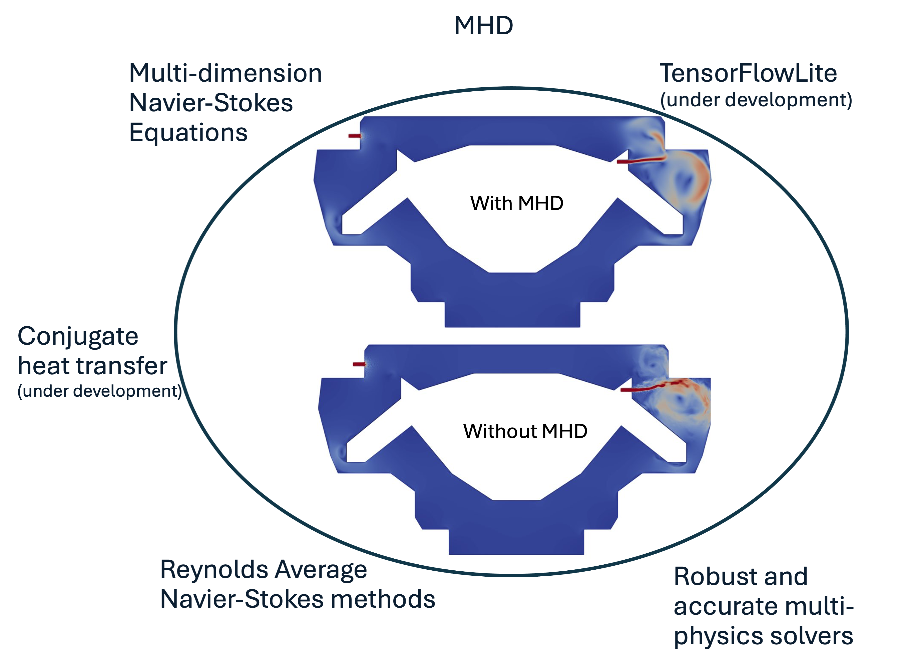

# Summary:

The demand for high-performance computational fluid dynamics and multiphysics software packages has grown in recent years as a response to effort in complex engineering and research applications. While the widespread deployment of high-performance computing (HPC) resources has enabled larger, more complex simulations to be conducted, few commercial or open-source software packages are available which scale performantly on computing power unit (CPU) and graphical computing unit (GPU) computing architectures, and represent the multitude of physical processes relevant to these applications. The VERTEX-CFD software is developed to address this technical gap, with a special emphasis on high-fidelity multiphysics modeling of coupled turbulent fluid flow, heat transfer, and magnetohydrodynamics for applications in fusion and fission energy, and other spaces. The VERTEX-CFD package was developed to solve the governing equations of these problems using a high-order continuous Galerkin finite element framework, and fully-implicit monolithic solvers. Special attention is being paid during the development process to verify and to validate the solver, and to ensure performance portability across both CPU and GPU computing platforms. A comprehensive verification and validation (V&V) suite and unit tests were designed to assess the accuracy and convergence behavior of the VERTEX-CFD software for problems taken from the published literature.

# Statement of need

Fusion energy development draws from a wide range of disciplines to describe design and to develop a functioning system. One challenging engineering task is to develop the fusion core component known as a blanket. Because this component surrounds the burning plasma and must absorb almost all of the power from nuclear reactions, it must breed fuel, provide nuclear shielding, and energy deposition. Molten salt (MS) is a primary choice for cooling the blanket. A “salt blanket” in fusion energy is a layer of molten salt surrounding the fusion plasma. The molten salt acts as both a coolant and a material for neutron absorption, which is essential in fusion reactions. It absorbs the high-energy neutrons produced by fusion, reducing the wear on reactor components and converting some of the energy into heat for electricity generation. Molten salts have low electrical and thermal conductivity experiencing lesser electromagnetic forces but are still turbulent. Heat transfer degradation in a MS flow caused by the reduction of turbulence by a magnetic field is a possible limitation for MS blanket [@Smolentsev01042005].

Two approaches are commonly adopted to model MS flows exposed to a magnetic field: high-fidelity modeling (large eddy simulation (LES) or direct numerical simulation (DNS)) and Reynolds-averaged Navier-Stokes (RANS) turbulence models. LESs can resolve turbulences at temporal and spatial scales to the expense of large HPC resources. The design of a blanket with LES is not possible because of current HPC limitations. Design optimization often requires multiple simulation runs to investigate performance under various conditions. The main technique that reduces the computational requirements of the analysis is RANS turbulence model. This approach filters out the instantaneous velocity component, and the influence of the turbulence is modeled solely by the closure models. The modeling of turbulence is a complex problem, and many turbulence models are available as described in the literature [@Chen_2022][@Menter1992ImprovedTK], albeit with many limitations [@10.1023/a:1022818327584]. Furthermore, these models are not readily applicable to the MHD flows and would require modifications [@Smolentsev2002] because MHD effects introduce additional terms in the turbulence balance equations.

VERTEX-CFD is a new open-source package designed to address the aforementioned challenges by leveraging and integrating artificial intelligence and machine learning (AI&ML) tools to enhance current turbulence models from high-fidelity datasets, and relying on a robust multi-physics solver that scales on HPC platforms.

# Current capabilities and development workflow

## Dependencies and deployment

The VERTEX-CFD package is an open-source code that is hosted on the ORNL GitHub account [https://github.com/ORNL/VERTEX-CFD](https://github.com/ORNL/VERTEX-CFD). VERTEX-CFD is built upon the [Trilinos package](https://trilinos.github.io/) [@trilinos-website] that provides a suite of tools for code development on HPC platforms. It has been deployed on a wide range of HPC platforms from small clusters to exascale computers alike Summit [@olcf-web], Frontier [@olcf-web], and Perlmutter [@nersc-web].

## Governing equations and discretization methods

The VERTEX-CFD software is still under active development and currently implements a set of partial differential equations (PDEs) discretized with a finite element method (FEM) and a high-order temporal integrators: entropically damped artificial compressibility (EDAC) Navier-Stokes equations [@Clausen2013], temperature equation, and induction-less magneto-hydrodynamic (MHD) equations. Coupling between the different physics is ensured by source terms that are the buoyancy force $f^B$ and the Lorentz force $f^L$. A conservative form of the set of PDEs is implemented in VERTEX-CFD as shown in \autoref{eq:pdes} and solves for the pressure $P$, the temperature $T$, the velocity $\mathbf{u}$ and the electric potential $\varphi$. The density $\rho$, the heat capacity $C_p$, the electrical conductivity $\sigma$, the thermal conductivity $k$, the thermal expansion $\beta$, are the fluid properties and are all assumed constant. The external magnetic field, the reference temperature for buoyancy force and the volumetric heat source are denoted by $\mathbf{B^0}$, $T_0$ and $q^{'''}$, respectively.

\begin{align}\label{eq:pdes}
\left\{
\begin{matrix}
    \partial_t P + \nabla \cdot ( P \mathbf{u}) = \frac{1}{M^2}\nabla \cdot ( \frac{C_p \mu}{\gamma k} \nabla P ) \\
    \partial_t \rho \mathbf{u} + \rho (\mathbf{u} \cdot \nabla) \mathbf{u} = -\nabla P + \rho \nu \Delta \mathbf{u} + f^L - f^B \\
    f^B = \rho \mathbf{g} \beta (T - T_0) \\
    f^L = \mathbf{J} \times \mathbf{B^0} = \sigma \left( -\nabla \varphi \times \mathbf{B^0} + (\mathbf{B} \cdot \mathbf{u}) \cdot \mathbf{B^0} - ||\mathbf{B^0}||^2 \mathbf{u} \right) \\
    \rho C_p \left( \partial_t T + \mathbf{u} \cdot \nabla T \right) = \nabla \cdot (k \nabla T ) + q^{'''} \\
    \nabla \cdot (\sigma \nabla \varphi) = \nabla \cdot [ \sigma \mathbf{u} \times \mathbf{B^0} ]
\end{matrix}
\right.
\end{align}

The above set of equations can be augmented with Reynolds Averaged Navier-Stokes (RANS) turbulence models, and the wall-adapting local eddy (WALE) viscosity model [@nicoud:hal-00910373] to model turbulent flows. A graphic representation of the capabilities available in VERTEX-CFD is provided in \autoref{fig:vertexcfd-capabilities}.

{ width=100% }

Solvers, finite element methods, and other relevant tools are provided by the [Trilinos package](https://trilinos.github.io/) [@trilinos-website]. The VERTEX-CFD software is designed to scale and to be compatible with various CPU and GPU architectures on HPC platforms by leveraging Kokkos [@kokkos] programming language. VERTEX-CFD software has demonstrated second-order temporal and spatial accuracy.

## Development workflow: testing, validation and verification

The long term objectives of the VERTEX-CFD project are to facilitate the addition of new physical models by relying on a plug-and-play architecture, and also to guarantee the correctness of the implemented model over time. New physics and equations are easily added to the global tree and allow for quick deployment of new physical model on HPC platforms.

Such approach can only be made possible by setting clear requirements and review process for all developers contributing to the project code: any changes and additions to the source code is reviewed and tested before being merged. VERTEX-CFD software is tested daily on a continuous integration (CI) workflow that is hosted on ORNL network. Each new physics is implemented in closure models with unit tests that are run on CPU and GPU nodes.

Physical models and coupling between equations were verified and validated against benchmark problems taken from the published literature: isothermal flows [@Taylor-green-vortex, @10.1115/1.3240731; @Clausen2013], heated flows [@Kuehn_Goldstein_1976; @tritton_1959], transient and steady-state cases, turbulent cases [@nicoud:hal-00910373; @nasa-web], and MHD flows [@SMOLENTSEV201565].

# Conclusions and current development activities

VERTEX-CFD is an open-source CFD solver that relies on a finite element discretization method to solve for the incompressible Navier-Stokes equations coupled to a temperature equation and MHD equation. Reynolds Averaged Navier-Stokes (RANS) turbulence models and large eddy simulation model are also available. The code relies on the  Trilinos package and offers a wide range of temporal integrators, solvers and preconditioners to run on CPU- and GPU-enabled platforms. VERTEX-CFD software was verified and validated for steady and unsteady incompressible flows with benchmark cases taken from the published literature: natural convection, viscous heating, laminar flow over a circle, and turbulent channels. It was also demonstrated that VERTEX-CFD software scales on CPUs (Perlmutter) and GPUs (Perlmutter and Summit) architectures.

The development tasks are currently focusing on three main activities that are:

- Implementation of a conjugate heat transfer model.

- Coupling with TensorFlowLite [@tensorflow2015-whitepaper] for AI&ML applications.

- Implementation of wall function for RANS models to enable high-Reynolds turbulence models.

# Acknowledgements

This work was funded by the Laboratory Directed Research and Development (LDRD) program at Oak Ridge National Laboratory. Research at Oak Ridge National Laboratory is supported under contract DE-AC05-00OR22725 from the U.S. Department of Energy to UT-Battelle, LLC.

# Disclaimer

This manuscript has been authored by UT-Battelle, LLC, under contract DE-AC05-00OR22725 with the US Department of Energy (DOE). The US government retains and the publisher, by accepting the article for publication, acknowledges that the US government retains a nonexclusive, paid-up, irrevocable, worldwide license to publish or reproduce the published form of this manuscript, or allow others to do so, for US government purposes. DOE will provide public access to these results of federally sponsored research in accordance with the [DOE Public Access Plan](http://energy.gov/downloads/doe-public-access-plan).

# References
